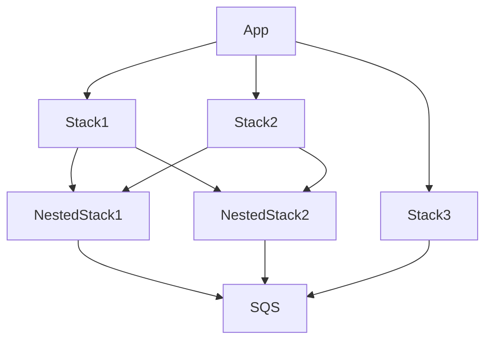

# AWS CDK NestedStackのメモ

## memo

```mermaid
graph TD
  A[App] --> B[Stack1]
  A --> C[Stack2]
  A --> D[Stack3]

  B --> E[NestedStack1]
  B --> F[NestedStack2]

  C --> E
  C --> F

  E --> I[SQS]
  F --> I
  D --> I
```