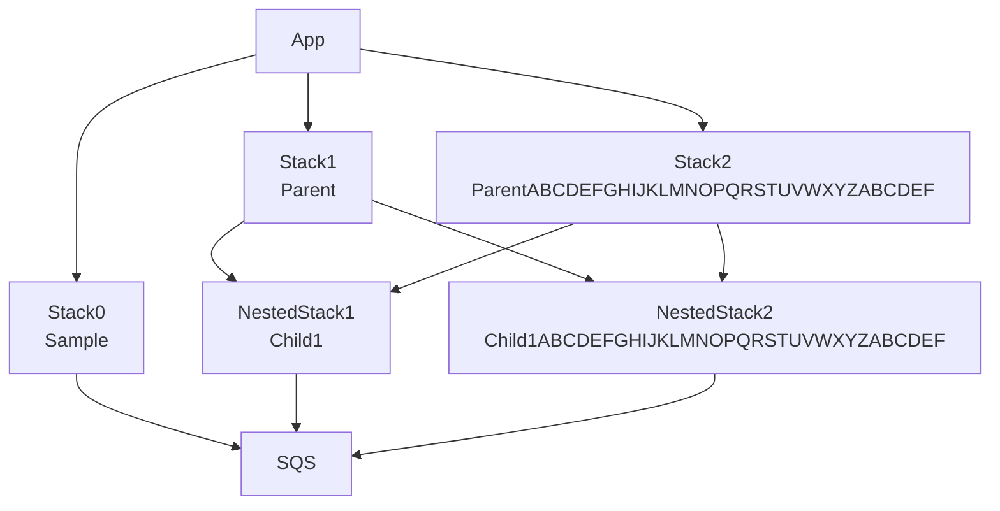

# AWS CDK NestedStackのメモ

## memo

## memo

| Stack論理ID | NestedStack論理ID | SQSリソース名 |
| ---- | ---- | ---- |
| Sample | - | Sample-SQSC7E1FD76-OMalN6txsi4r |
| Parent | Child1 | Parent-Child1NestedStackChild1NestedStackResource1C0E05-SQSC7E1FD76-K4ovxTYKtpXO |
| Parent | Child1ABCDEFGHIJKLMNOPQRSTUVWXYZABCDEF | Parent-Child1ABCDEFGHIJKLMNOPQRST-SQSABCDEFGHIJKLMNOPQRSTUVWXYZABCD-Knl9NQxQZgr8 |
| ParentABCDEFGHIJKLMNOPQRSTUVWXYZABCDEF | Child2 | ParentABCDEFGHIJKLMNOPQRSTUVWXYZABCDEF-Child2NestedStac-SQSC7E1FD76-Ggi1PZj7OyDH |
| ParentABCDEFGHIJKLMNOPQRSTUVWXYZABCDEF | Child2ABCDEFGHIJKLMNOPQRSTUVWXYZABCDEF | ParentABCDEFGHIJKLMNOPQRSTUVWXYZA-SQSABCDEFGHIJKLMNOPQRSTUVWXYZABCD-Jc2t2SeamExu |